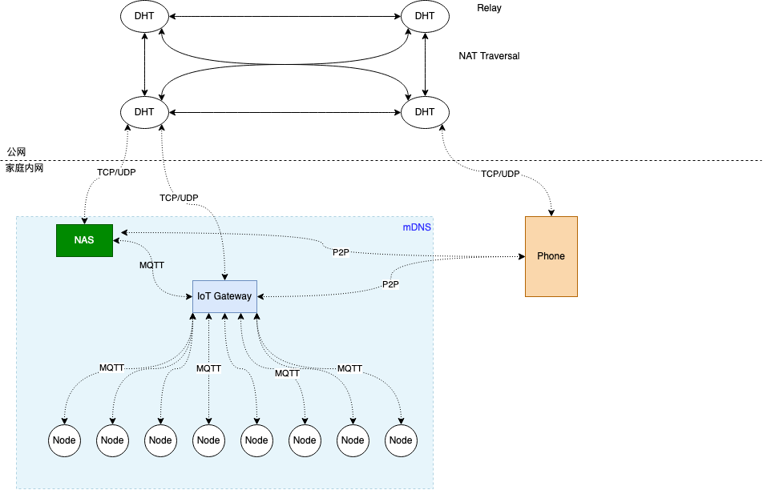

# Home Computing

智能家居设备越来越普及，目前市面上几乎所有的设备都是设备连接到公网，然后所有数据都保存到第三方，各种物联网设备带来方便的同时，也将你的生活习惯，甚至日常交流等都会共享到第三方，导致一系列令人恶心的事。

所以我决定将云放入家庭，类似私有云的方式，同时降低成本，采用P2P的方式实现手机与家庭互联。

公网有一个或者多个分布式哈希表（DHT），可以自建，也可以使用公共节点，DHT通过公钥哈希来定位公钥。家庭有NAS和IoT Gateway，这两个设备构成家庭物联网设备的核心。

NAS负责数据筛选、数据分析和存储，同时NAS上还可以运行一些其他服务，比如我现在运行了Nginx+php+mysql+MediaWiki，负责我和女朋友日常工作和生活的资料索引。NAS通过P2P与手机或者电脑进行直接通信。

IoT Gateway负责家庭所有物联网设备节点的接入，节点配网之后，通过mDNS获取IoT Gateway，通过MQTT进行连接，而IoT Gateway通过DHT和mDNS和手机与NAS进行直接通信。

P2P是整个系统的核心，它提供：

1. 支持点对点（TCP穿越NAT、IPv6直联）
2. 如果无法点对点，那么通过公网节点中转，使用TCP。
3. 如果在同一个局域网内，则自动选择局域网内转发，而不需要通过公网或者打洞
4. 数据通信端对端加密
5. 通过节点ID建立连接
6. 可靠的通信
7. 去中心化（DHT）

Node使用BL602，通过Wi-Fi+MQTT与IoT Gateway连接。IoT Gateway提供统一界面实现家庭所有设备的控制，NAS将控制记录，家庭设备状态等记录，并进行分析并给出预警，通过IoT Gateway推送至手机端。

技术栈：FreeBSD+ZFS+jails+golang+P2P+MQTT+mDNS+MySQL+libsodium+前端相关+嵌入式相关

经过调研，IPFS的libp2p可以基本满足p2p的需求。

目前先想这么多，后面再补充。